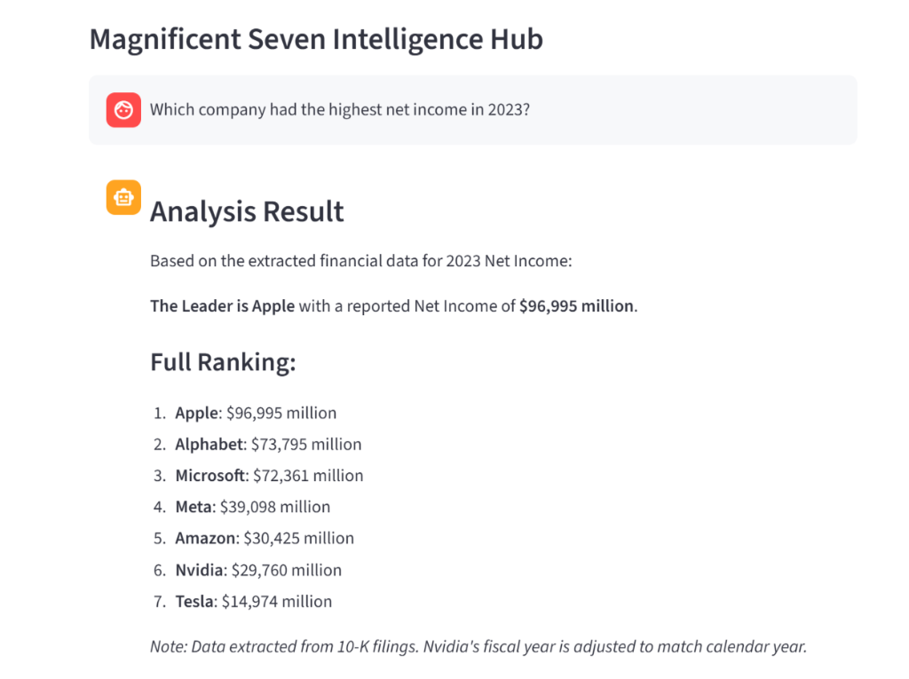

# AlphaQuest: Finance RAG

A high-fidelity Financial RAG (Retrieval-Augmented Generation) system for analyzing 10-K filings of the "Magnificent Seven" tech companies.

Built with **LlamaIndex** and **Llama 3**, featuring deterministic data extraction logic for accurate financial metrics retrieval.


## Features

- **Intelligent Query Routing** - Automatically detects target companies and metrics from natural language questions
- **Multi-Year Analysis** - Supports 2023 and 2024 fiscal year data comparison
- **Deterministic Extraction** - Uses regex-based extraction with company-specific column awareness for accurate results
- **Interactive Chat UI** - Clean Streamlit interface with chat history and expandable fact sheets
- **Metadata Filtering** - Precise document retrieval using company and year filters

## Covered Companies

| Company | Ticker | 10-K Years |
|---------|--------|------------|
| Apple | AAPL | 2023, 2024 |
| Microsoft | MSFT | 2023, 2024 |
| Alphabet (Google) | GOOG | 2023, 2024 |
| Amazon | AMZN | 2023, 2024 |
| Nvidia | NVDA | 2023, 2024 |
| Meta | META | 2023, 2024 |
| Tesla | TSLA | 2023, 2024 |

## Tech Stack

- **LLM**: Llama 3 (via Ollama)
- **Embeddings**: Llama 3 Embeddings (via Ollama)
- **RAG Framework**: LlamaIndex
- **Vector Store**: LlamaIndex SimpleVectorStore (Local JSON)
- **PDF Processing**: PyMuPDF4LLM (Markdown-based extraction)
- **Frontend**: Streamlit

## Installation

### Prerequisites

- Python 3.9+
- [Ollama](https://ollama.ai/) installed with Llama 3 model

### Setup

1. **Clone the repository**
   ```bash
   git clone https://github.com/marcomarcotse/AlphaQuest-Finance-RAG.git
   cd AlphaQuest-Finance-RAG
   ```

2. **Create virtual environment**
   ```bash
   python -m venv venv
   
   # Windows
   venv\Scripts\activate
   
   # macOS/Linux
   source venv/bin/activate
   ```

3. **Install dependencies**
   ```bash
   pip install -r requirements.txt
   ```

4. **Pull Llama 3 model**
   ```bash
   ollama pull llama3
   ```

5. **Prepare data**
   
   Place your 10-K PDF files in the `data/` directory with the naming convention:
   ```
   {YEAR}-{TICKER}-10K.pdf
   ```
   Example: `2024-AAPL-10K.pdf`

6. **Build the index**
   ```bash
   python ingest.py
   ```

## Usage

Start the application:

```bash
streamlit run app.py
```

Open your browser at `http://localhost:8501`



### Example Queries

- "Which company had the highest net income in 2024?"
- "Compare the revenue of Apple and Microsoft in 2023"
- "What was Nvidia's net income in 2024?"

## Challenges Solved

- **Alphabet's Column Shift** - Handled Alphabet's unique ascending year columns in 10-K tables (all other companies use descending) through custom column-index mapping logic.
- **Nvidia's Fiscal Calendar** - Implemented logic to align Nvidia's non-standard fiscal year (ending January) with the calendar year for accurate cross-company comparison.
- **Hallucination Prevention** - Eliminated numeric hallucinations by replacing raw LLM reasoning with a hybrid "LLM Routing + Regex Extraction + Python Sorting" approach.

## Project Structure

```
AlphaQuest-Finance-RAG/
├── app.py              # Main Streamlit application
├── ingest.py           # PDF ingestion and index building
├── requirements.txt    # Python dependencies
├── data/               # 10-K PDF files (not tracked in git)
├── storage/            # Vector index storage (not tracked in git)
└── README.md
```

## License

This project is for educational and portfolio purposes.

## Author

**Marco Tse** - [GitHub](https://github.com/marcomarcotse)
